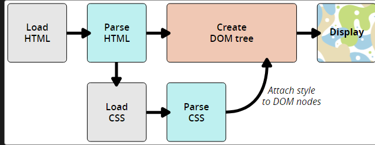

# HTML

## [HTML 头部](https://developer.mozilla.org/zh-CN/docs/Learn/HTML/Introduction_to_HTML/The_head_metadata_in_HTML#什么是_html_头部)

> HTML 头部包含 HTML`<head>`元素的内容，它的作用是保存页面的一些[元数据](https://developer.mozilla.org/zh-CN/docs/Glossary/Metadata)。

**常见头部元素：**

1. 标题`<title>`

   用于设置网页标题

   ```html
   <head>
     <meta charset="utf-8" />
     <title>我的测试页面</title>
   </head>
   ```

   

2. 元数据：`<meta>` 元素

   指定文档字符编码

   ```html
   <meta charset="utf-8" />
   ```

   

3. 网页增加自定义图标

   你可以在元数据中添加对自定义图标的引用，它们会在某些场景下显示。最常见的用例为 favicon（为“favorites icon”的缩写，在浏览器的“收藏夹”及“书签”列表中显示）。

   ```html
   <link rel="icon" href="favicon.ico" type="image/x-icon" />
   ```

   以 .ico 格式保存（大多数浏览器支持更通用的格式，如 .gif 或 .png）

   

4. 在 HTML 中应用 CSS 和 JavaScript

   * `<link>` 元素经常位于文档的头部，它有 2 个属性，rel="stylesheet" 表明这是文档的样式表，而 href 包含了样式表文件的路径：

     ```html
     <link rel="stylesheet" href="my-css-file.css" />
     ```

   * `<script>`元素用于加载js文件，`src`用于指向js文件的加载路径，`defer`用于告诉浏览器html解析完了再加载js文件，这样你就不会因为 JavaScript 试图访问页面上不存在的 HTML 元素而产生错误：

     ```html
     <script src="my-js-file.js" defer></script>
     ```


5. 为文档设定主语言

   可以（而且有必要）为站点设定语言，这个可以通过添加`lang 属性`到 HTML 开始的标签中来实现

   ```html
   <html lang="zh-CN">
     …
   </html>
   ```

   

## 块级元素和内联元素

> 在 HTML 中有两种需要知道的重要元素类别，**块级元素**和**内联元素**。

**块级元素：**

块级元素以块的形式展现，一个块级元素出现在前面内容的新行上，一个块级元素不会嵌套在一个内联样式中，但可以嵌套在其他块级元素中


**内联样式：**

内联元素通常出现在块级元素中并环绕文档内容的一小部分，内联元素不会导致文本换行。它通常与文本一起使用

## 文本处理

### 段落和标题

在 HTML 中，每个**段落**是通过 `<p>`元素标签进行定义的：

```html
<p>我是一个段落，千真万确。</p>
```


每个**标题**（Heading）都必须被包裹在一个标题元素中：

```html
<h1>我是文章的标题</h1>
```

共有六种标题元素标签——h1、h2、h3、h4、h5 和 h6。每个元素代表文档中不同级别的内容：`<h1>` 表示主标题，`<h2>` 表示二级子标题，`<h3>` 表示三级子标题，依此类推


### 编辑结构层次

在一个故事中，`<h1>` 表示故事的名字，`<h2>` 表示每个章节的标题，`<h3>` 表示每个章节下的子标题，以此类推。

```html
<h1>三国演义</h1>

<p>罗贯中</p>

<h2>第一回 宴桃园豪杰三结义 斩黄巾英雄首立功</h2>

<p>话说天下大势，分久必合，合久必分。周末七国分争，并入于秦。及秦灭之后，楚、汉分争，又并入于汉……</p>

<h2>第二回 张翼德怒鞭督邮 何国舅谋诛宦竖</h2>

<p>且说董卓字仲颖，陇西临洮人也，官拜河东太守，自来骄傲。当日怠慢了玄德，张飞性发，便欲杀之……</p>

<h3>却说张飞</h3>

<p>却说张飞饮了数杯闷酒，乘马从馆驿前过，见五六十个老人，皆在门前痛哭。飞问其故，众老人答曰：“督邮逼勒县吏，欲害刘公；我等皆来苦告，不得放入，反遭把门人赶打！”……</p>
```

所涉及的元素具体代表什么，完全取决于作者编辑的内容，只要层次结构是合理的。在创建此类结构时，只需要记住一些最佳实践：

- 最好只对每个页面使用一次 `<h1>`——这是顶级标题，所有其他标题位于层次结构中的下方。
- 请确保在层次结构中以正确的顺序使用标题。不要使用 `<h3>` 来表示副标题，后面再跟 `<h2>` 来表示二级副标题——这是没有意义的，会导致奇怪的结果。
- 在现有的六个标题层次中，除非觉得有必要，否则应该争取每页使用不超过三个。有很多层次的文件（例如，深层次的标题层次）会变得笨重，难以浏览。在这种情况下，如果可能的话，建议将内容分散到多个页面。

### 列表

#### **无序列表**

无序列表用于标记列表项目顺序无关紧要的列表

```html
<ul>
  <li>豆浆</li>
  <li>油条</li>
  <li>豆汁</li>
  <li>焦圈</li>
</ul>
```

输出：

- 豆浆

- 油条

- 豆汁

- 焦圈

  

#### **有序列表**

有序列表需要按照项目的顺序列出来

```html
<ol>
  <li>沿这条路走到头</li>
  <li>右转</li>
  <li>直行穿过第一个十字路口</li>
  <li>在第三个十字路口处左转</li>
  <li>继续走 300 米，学校就在你的右手边</li>
</ol>

```

输出：

1. 沿着条路走到头

2. 右转

3. 直行穿过第一个十字路口

4. 在第三个十字路口处左转

5. 继续走 300 米，学校就在你的右手边

   

#### **嵌套列表**

将一个列表嵌入到另一个列表是完全可以的。

```html
<ol>
  <li>先用蛋白一个、盐半茶匙及淀粉两大匙搅拌均匀，调成“腌料”，鸡胸肉切成约一厘米见方的碎丁并用“腌料”搅拌均匀，腌渍半小时。</li>
  <li>用酱油一大匙、淀粉水一大匙、糖半茶匙、盐四分之一茶匙、白醋一茶匙、蒜末半茶匙调拌均匀，调成“综合调味料”。</li>
  <li>鸡丁腌好以后，色拉油下锅烧热，先将鸡丁倒入锅内，用大火快炸半分钟，炸到变色之后，捞出来沥干油汁备用。</li>
  <li>在锅里留下约两大匙油，烧热后将切好的干辣椒下锅，用小火炒香后，再放入花椒粒和葱段一起爆香。随后鸡丁重新下锅，用大火快炒片刻后，再倒入“综合调味料”继续快炒。
    <ul>
      <li>如果你采用正宗川菜做法，最后只需加入花生米，炒拌几下就可以起锅了。</li>
      <li>如果你在北方，可加入黄瓜丁、胡萝卜丁和花生米，翻炒后起锅。</li>
    </ul>
  </li>
</ol>

```

输出：

1. 先用蛋白一个、盐半茶匙及淀粉两大匙搅拌均匀，调成“腌料”，鸡胸肉切成约一厘米见方的碎丁并用“腌料”搅拌均匀，腌渍半小时。
2. 用酱油一大匙、淀粉水一大匙、糖半茶匙、盐四分之一茶匙、白醋一茶匙、蒜末半茶匙调拌均匀，调成“综合调味料”。
3. 鸡丁腌好以后，色拉油下锅烧热，先将鸡丁倒入锅内，用大火快炸半分钟，炸到变色之后，捞出来沥干油汁备用。
4. 在锅里留下约两大匙油，烧热后将切好的干辣椒下锅，用小火炒香后，再放入花椒粒和葱段一起爆香。随后鸡丁重新下锅，用大火快炒片刻后，再倒入“综合调味料”继续快炒。
   - 如果你采用正宗川菜做法，最后只需加入花生米，炒拌几下就可以起锅了。
   - 如果你在北方，可加入黄瓜丁、胡萝卜丁和花生米，翻炒后起锅。

#### 描述列表

这种列表的目的是标记一组项目及其相关描述，例如术语和定义，或者是问题和答案等。

### 重点强调

在日常用语中，我们常常会加重某个字的读音，或者用加粗等方式突出某句话的重点。与此类似，HTML 也提供了相应的标签，用于标记某些文本，使其具有加粗、倾斜、下划线等效果。

```html
<dl>
  <dt>内心独白</dt>
    <dd>戏剧中，某个角色对自己的内心活动或感受进行念白表演，这些台词只面向观众，而其他角色不会听到。</dd>
  <dt>语言独白</dt>
    <dd>戏剧中，某个角色把自己的想法直接进行念白表演，观众和其他角色都可以听到。</dd>
  <dt>旁白</dt>
    <dd>戏剧中，为渲染幽默或戏剧性效果而进行的场景之外的补充注释念白，只面向观众，内容一般都是角色的感受、想法、以及一些背景信息等。</dd>
</dl>
```

输出：

内心独白

​			戏剧中，某个角色对自己的内心活动或感受进行念白表演，这些台词只面向观众，而其他角色不会听到。

语言独白

​			戏剧中，某个角色把自己的想法直接进行念白表演，观众和其他角色都可以听到。

旁白

​			戏剧中，为渲染幽默或戏剧性效果而进行的场景之外的补充注释念白，只面向观众，内容一般都是角色的感受、想法、			以及一些背景信息等。


请注意：一个术语可以同时有多个描述，比如说：

```html
<dl>
  <dt>旁白</dt>
  <dd>
    戏剧中，为渲染幽默或戏剧性效果而进行的场景之外的补充注释念白，只面向观众，内容一般都是角色的感受、想法、以及一些背景信息等。
  </dd>
  <dd>
    写作中，指与当前主题相关的一段内容，通常不适于直接置于内容主线中，因此置于附近的其他位置（通常位于主线内容旁边一个文本框内）。
  </dd>
</dl>
```

输出：

旁白

​		戏剧中，为渲染幽默或戏剧性效果而进行的场景之外的补充注释念白，只面向观众，内容一般都是角色的感受、想法、以		及一些背景信息等。

​		写作中，指与当前主题相关的一段内容，通常不适于直接置于内容主线中，因此置于附近的其他位置（通常位于主线内容		旁边一个文本框内）。


#### **强调**

在 HTML 中我们用 `<em>`（emphasis）元素来标记这样的情况。这样做既可以让文档读起来更有趣，**也可以被屏幕阅读器识别，并以不同的语调发出。**浏览器默认样式为斜体，但你不应该纯粹为了获得斜体风格而使用这个标签。

```html
<p>我很<em>庆幸</em>你没有<em>迟到</em>。</p>
```

输出：

​          我很*庆幸*你没有*迟到*。

#### 强烈的重要性

为了强调重要的词，在口语方面我们往往用重音强调，在书面用语中则是用粗体字来达到强调的效果。

```html
<p>这杯液体<strong>毒性很大</strong>。</p>

<p>就指望你了，千万<strong>不要</strong>迟到！</p>
```

输出：

​		这杯液体**毒性很大**。

​		就指望你了，千万**不要**迟到！

### 超链接

通过将文本或其他内容包裹在  `<a>`元素内，并给它一个包含网址的 [`href`](https://developer.mozilla.org/zh-CN/docs/Web/HTML/Element/a#href) 属性（也称为**超文本引用**或**目标**，它将包含一个网址）来创建一个基本链接。

#### 块级链接

就像之前提到的那样，任何内容，甚至`块级内容`都可以作为链接出现。如果想让标题元素变为链接，就把它包裹在锚点元素（`<a>`）内，像这个代码段一样：

```html
<a href="https://developer.mozilla.org/zh-CN/"><h1>MDN Web 文档</h1></a>
<p>自从 2005 年起，就开始记载包括 CSS、HTML、JavaScript 等网络技术。</p>
```

#### 图片链接

如果有需要作为链接的图片，使用 `<a>` 元素来包裹要引用图片的 `` 元素。

```html
<a href="https://developer.mozilla.org/zh-CN/">
  
</a>
```


#### 使用 title 属性添加支持信息

你可能要添加到你的链接的另一个属性是 `title`。这旨在包含关于链接的补充信息，当鼠标指针悬停在链接上时，标题将作为提示信息出现

```html
<p>
  我创建了一个指向<a href="https://www.mozilla.org/zh-CN/"
   title="了解 Mozilla 使命以及如何参与贡献的最佳站点。">Mozilla 主页</a>的超链接。
</p>
```

#### 文档片段

超链接除了可以链接到文档外，也可以链接到 HTML 文档的特定部分（被称为**文档片段**）。

你必须首先给要链接到的元素分配一个 [`id`](https://developer.mozilla.org/zh-CN/docs/Web/HTML/Global_attributes#id) 属性。

```html
<h2 id="Mailing_address">邮寄地址</h2>
```

为了链接到那个特定的 `id`，要将它放在 URL 的末尾，并在前面包含井号（`#`），例如：

```html
<p>
  要提供意见和建议，请将信件邮寄至<a href="contacts.html#Mailing_address">我们的地址</a>。
</p>
```

你甚至可以在同一份文档下，通过链接文档片段，来链接到*当前文档的另一部分*：

```html
<p>
  本页面底部可以找到<a href="#Mailing_address">公司邮寄地址</a>。
</p>
```

#### 在下载链接时使用 download 属性

当你链接到要下载的资源而不是在浏览器中打开时，你可以使用 `download` 属性来提供一个默认的保存文件名。下面是一个 Firefox 的 Windows 最新版本下载链接的示例：

```html
<a href="https://download.mozilla.org/?product=firefox-latest-ssl&os=win64&lang=zh-CN"
   download="firefox-latest-64bit-installer.exe">
  下载最新的 Firefox 中文版 - Windows（64 位）
</a>
```

## 文档与网站架构

> HTML 代码中可根据功能来为区段添加标记。可使用元素来无歧义地表示上文所讲的内容区段，屏幕阅读器等辅助技术可以识别这些元素，并帮助执行“找到主导航“或”找到主内容“等任务。

### 用于构建内容的 HTML

为了实现语义化标记，HTML 提供了明确这些区段的专用标签，例如：

```html
<header>：页眉。
<nav>：导航栏。
<main>：主内容。主内容中还可以有各种子内容区段，可用<article>、<section> 和 <div> 等元素表示。存放每个页面独有的内容。每个页面只能拥有一个		    <main>，放在<body>中，最好不要把它嵌套在其他元素中
<aside>：侧边栏，经常嵌套在 <main> 中。
<footer>：页脚。
```

### 无语义元素

对于那些语义元素无法满足得内容，HTML提供了无语义元素：`<div>`和 `<span>`。应配合使用 [`class`](https://developer.mozilla.org/zh-CN/docs/Web/HTML/Global_attributes#class) 属性提供一些标签，使这些元素能易于查询。

### 换行与水平分割线

#### `<br>`：换行元素

`<br>` 可在段落中进行换行；`<br>` 是唯一能够生成多个短行结构

#### `<hr>`：换行元素

`<hr>` 元素在文档中生成一条水平分割线，表示文本中主题的变化

## 多媒体与嵌入

### 图片

#### 路径

我们可以用 ``元素来把图片放到网页上。它是一个空元素（它不需要包含文本内容或闭合标签），最少只需要一个 `src`


举个例子来看，如果你有一幅文件名为 `dinosaur.jpg` 的图片，且它与你的 HTML 页面存放在相同路径下，那么你可以这样嵌入它：

```html

```

如果这张图片存储在和 HTML 页面同路径的 `images` 文件夹下（这也是 Google 推荐的做法，利于[SEO](https://developer.mozilla.org/zh-CN/docs/Glossary/SEO)/索引），那么你可以采用如下形式：

```html

```


备注： 搜索引擎也读取图像的文件名并把它们计入 SEO。因此你应该给你的图片取一个描述性的文件名


#### 备选文本

下一个我们讨论的属性是 `alt` ，它的值应该是对图片的文字描述，用于在图片无法显示或不能被看到的情况。

```html

```

那么，为什么我们需要备选文本呢？它可以派上用场的原因有很多：

- 用户有视力障碍，通过`屏幕阅读器`来浏览网页。事实上，给图片一个备选的描述文本对大多数用户都是很有用的。
- 就像上面所说的，你也许会把图片的路径或文件名拼错。
- 浏览器不支持该图片类型。某些用户仍在使用纯文本的浏览器，例如 `Lynx`，这些浏览器会把图片替换为描述文本。
- 你会想提供一些文字描述来给搜索引擎使用，例如搜索引擎可能会将图片的文字描述和查询条件进行匹配。
- 用户关闭的图片显示以减少数据的传输，这在手机上是十分普遍的，并且在一些国家带宽有限且昂贵。

#### 宽度和高度

你可以用宽度和高度属性来指定你的图片的高度和宽度

```html

```

在正常的情况下，这不会对显示产生很大的影响，但是如果图片没有显示，你会注意到浏览器会为要显示的图片**留下一定的空间**：

#### Image titles 图片标题

这会给我们一个鼠标悬停提示，看起来就像链接标题：

```html

```

#### 与CSS背景图片的区别

css插入的图片完全没有语义上的意义，它们不能有任何备选文本，也不能被屏幕阅读器识别。这就是 HTML 图片有用的地方了。

### 视频和音频内容

#### 视频

` <video> `允许你轻松地嵌入一段视频。一个简单的例子如下：

```html
<video src="rabbit320.webm" controls>
  <p>你的浏览器不支持 HTML5 视频。可点击<a href="rabbit320.mp4">此链接</a>观看</p>
</video>
```

当中的一些属性如下：

- `src`：`src` 属性指向你想要嵌入网页当中的视频资源
- `controls`：浏览器提供的控件界面，用户能够控制视频和音频的回放功能。
- `</video>`标签内的内容：这个叫做**后备内容** — 当浏览器不支持 `<video>` 标签的时候，就会显示这段内容

#### 使用多个播放源以提高兼容性

```html
<video controls>
  <source src="rabbit320.mp4" type="video/mp4">
  <source src="rabbit320.webm" type="video/webm">
  <p>你的浏览器不支持 HTML5 视频。可点击<a href="rabbit320.mp4">此链接</a>观看</p>
</video>
```

现在我们将 `src` 属性从 `<video>` 标签中移除，转而将它放在几个单独的标签`<source>` 当中。在这个例子当中，浏览器将会检查 `<source>` 标签，并且播放第一个与其自身 codec 相匹配的媒体。你的视频应当包括 WebM 和 MP4 两种格式，这两种在目前已经足够支持大多数平台和浏览器。

#### 其他 `<video>` 特性

- `width 和 height`：你可以用属性控制视频的尺寸，视频会保持它原始的长宽比 — 也叫做**纵横比**。如果你设置的尺寸没有保持视频原始长宽比，那么视频边框将会拉伸
- `autoplay`：这个属性会使音频和视频内容立即播放，即使页面的其他部分还没有加载完全。
- `loop`：这个属性可以让音频或者视频文件循环播放。同样不建议使用，除非有必要。
- `muted`：这个属性会导致媒体播放时，默认关闭声音。
- `poster`：视频播放前封面 
- `preload`：这个属性被用来缓冲较大的文件，有 3 个值可选：`"none"` ：不缓冲、`"auto"` ：页面加载后缓存媒体文件、`"metadata"` ：仅缓冲文件的元数据

#### 显示音轨文本

现在，我们将讨论一个略微先进的概念，这个概念将会十分的有用。许多人不想（或者不能）听到 Web 上的音频/视频内容，至少在某些情况下是这样的，比如：

- 许多人患有听觉障碍（通常来说是很难听清声音的人，或者聋人），所以他们不能听见音频中的声音。
- 另外的情况可能是由于人们并不能听音频，可能是因为他们在一个非常嘈杂的环境当中（比如在一个拥挤的酒吧内恰好赶上了球赛），也可能是由于他们并不想打扰到其他人（比如在一个十分安静的地方，例如图书馆）。
- 有一些人他们不说音频当中的语言，所以他们听不懂，因此他们想要一个副本或者是翻译来帮助他们理解媒体内容。

一个典型的 WebVTT 文件如下：

```
WEBVTT

1
00:00:22.230 --> 00:00:24.606
第一段字幕

2
00:00:30.739 --> 00:00:34.074
第二段

  ...
```

Copy to Clipboard

让其与 HTML 媒体一起显示，你需要做如下工作：

1. 以 .vtt 后缀名保存文件。
2. 用 `<track>` 标签链接 .vtt 文件， `<track>` 标签需放在 `<audio>` 或 `<video>` 标签当中，同时需要放在所有 `<source>` 标签之后。使用 kind 属性来指明是哪一种类型，如 subtitles、captions、descriptions。然后，使用 srclang 来告诉浏览器你是用什么语言来编写的 subtitles。

如下：

```
<video controls>
    <source src="example.mp4" type="video/mp4">
    <source src="example.webm" type="video/webm">
    <track kind="subtitles" src="subtitles_en.vtt" srclang="en">
</video>
```

Copy to Clipboard

上面这串代码会显示一段带有字幕的视频

# CSS

## 使用类名

你可以给 HTML 元素加个类名（class），使用这种方式样式化这一片元素

```html
<ul>
  <li>项目一</li>
  <li class="special">项目二</li>
  <li>项目 <em>三</em></li>
</ul>
```

在 CSS 中，要选中这个 `special` 类，只需在选择器的开头加个西文句点（.）。在你的 CSS 文档里加上如下代码：

```css
.special {
  color: orange;
  font-weight: bold;
}
```

这个 `special` 类型可不局限于列表，它可以应用到各种元素上。

## 根据状态确定样式

当我们修改一个链接的样式时我们需要定位（针对） `<a>` （锚）标签。取决于是否是未访问的、访问过的、被鼠标悬停的、被键盘定位的，亦或是正在被点击当中的状态，这个标签有着不同的状态。

下面的 CSS 代码使得没有被访问的链接颜色变为粉色、访问过的链接变为绿色。

```css
a:link {
  color: pink;
}

a:visited {
  color: green;
}
```

## 内联样式

内联样式是影响单个 HTML 元素的 CSS 声明，包含在元素的 `style` 属性中。在一个 HTML 文档中，内联样式的实现可能看起来像这样：

```html
<html lang="zh-CN">
  <head>
    <meta charset="utf-8" />
    <title>我的 CSS 测试</title>
  </head>
  <body>
    <h1 style="color: blue;background-color: yellow;border: 1px solid black;">
      Hello World!
    </h1>
    <p style="color:red;">这是我的第一个 CSS 示例</p>
  </body>
</html>
```

尽可能避免以这种方式使用 CSS。这不符合最佳实践。首先，这是对 CSS 的维护效率最低的实现。一个样式的改变可能需要在一个网页中进行多次编辑。其次，内联 CSS 还将（CSS）表现性代码与 HTML 内容混合在一起，使一切都更难阅读和理解。将代码和内容分开，可以使所有从事网站工作的人更容易维护。

## CSS 究竟是怎么工作的？

当浏览器展示一个文件的时候，它必须兼顾文件的内容和文件的样式信息，下面我们会了解到它处理文件的标准的流程。需要知道的是，下面的步骤是浏览加载网页的简化版本，而且不同的浏览器在处理文件的时候会有不同的方式，但是下面的步骤基本都会出现。

1. 浏览器载入 HTML 文件（比如从网络上获取）。
2. 将 HTML 文件转化成一个 DOM（Document Object Model），DOM 是文件在计算机内存中的表现形式，下一节将更加详细的解释 DOM。
3. 接下来，浏览器会拉取该 HTML 相关的大部分资源，比如嵌入到页面的图片、视频和 CSS 样式。JavaScript 则会稍后进行处理，简单起见，同时此节主讲 CSS，所以这里对如何加载 JavaScript 不会展开叙述。
4. 浏览器拉取到 CSS 之后会进行解析，根据选择器的不同类型（比如 element、class、id 等等）把他们分到不同的“桶”中。浏览器基于它找到的不同的选择器，将不同的规则（基于选择器的规则，如元素选择器、类选择器、id 选择器等）应用在对应的 DOM 的节点中，并添加节点依赖的样式（这个中间步骤称为渲染树）。
5. 上述的规则应用于渲染树之后，渲染树会依照应该出现的结构进行布局。
6. 网页展示在屏幕上（这一步被称为着色）。

结合下面的图示更形象：



## CSS 选择器

> CSS 选择器是 CSS 规则的第一部分。它是元素和其他部分组合起来告诉浏览器哪个 HTML 元素应当是被选为应用规则中的 CSS 属性值的方式。选择器所选择的元素，叫做“选择器的对象”。

### 类型选择器

**类型选择器**有时也叫做“标签名选择器*”*或者是”元素选择器“，因为它在文档中选择了一个 HTML 标签/元素的缘故。

```css
span {
    background-color: yellow;
}

strong {
    color: rebeccapurple;
}

em {
    color: rebeccapurple;
} 
```

### 全局选择器

全局选择器，是由一个星号（`*`）代指的，它选中了文档中的所有内容

```css
* {
    margin: 0;
}
```

### 类选择器

类选择器以一个句点（.）开头，会选择文档中应用了这个类的所有物件。

```css
.highlight {
    background-color: yellow;
}
```

### 指向特定元素的类

我们将会用不同方式高亮一个带有highlight类的`<span>`和带有 highlight类的`<h1>`标题。

```css
span.highlight {
    background-color: yellow;
}

h1.highlight {
    background-color: pink;
}
```

也可以指定存在多个类存在得元素：

```css
.notebox {
  border: 4px solid #666;
  padding: .5em;
}

.notebox.warning {
  border-color: orange;
  font-weight: bold;
}

.notebox.danger {
  border-color: red;
  font-weight: bold;
}
```

### ID 选择器

ID 选择器开头为`#`而非句点，不过基本上和类选择器是同种用法。可是在一篇文档中，一个 ID 只会用到一次。它能选中设定了`id`的元素，你可以在 ID 前面加上类型选择器，只指向元素和 ID 都匹配的类。

```css
#one {
    background-color: yellow;
}

h1#heading {
    color: rebeccapurple;
}
  
```

正如我们在和特定性相关的课里面学到的那样，ID 所指特定，会优先于大多数其他选择器。所以很难处理它们。大多数情况下，给一个元素加个类，而不是使用 ID，会更好。不过要是 ID 是唯一一种指定这个元素的方式的话——也许是因为你没法访问标记标记因此不能编辑——这种方式可行。

### 属性选择器

#### 存否和值选择器

这些选择器允许基于一个元素自身是否存在（例如href）或者基于各式不同的按属性值的匹配，来选取元素。

| 选择器              | 示例                            | 描述                                                         |
| :------------------ | :------------------------------ | :----------------------------------------------------------- |
| `[*attr*]`          | `a[title]`                      | 匹配带有一个名为*attr*的属性的元素——方括号里的值。           |
| `[*attr*=*value*]`  | `a[href="https://example.com"]` | 匹配带有一个名为*attr*的属性的元素，其值正为*value*——引号中的字符串。 |
| `[*attr*~=*value*]` | `p[class~="special"]`           | 匹配带有一个名为*attr*的属性的元素，其值正为*value*，或者匹配带有一个*attr*属性的元素，其值有一个或者更多，至少有一个和*value*匹配。注意，在一列中的好几个值，是用空格隔开的。 |
| `[*attr*|=*value*]` | `div[lang|="zh"]`               | 匹配带有一个名为*attr*的属性的元素，其值可正为*value*，或者开始为*value*，后面紧随着一个连字符。 |

#### 子字符串匹配选择器

这些选择器让更高级的属性的值的子字符串的匹配变得可行。例如，如果你有box-warning和box-error类，想把开头为“box-”字符串的每个物件都匹配上的话，你可以用[class^="box-"]来把它们两个都选中。

| 选择器          | 示例                | 描述                                                         |
| :-------------- | :------------------ | :----------------------------------------------------------- |
| `[attr^=value]` | `li[class^="box-"]` | 匹配带有一个名为*attr*的属性的元素，其值开头为*value*子字符串。 |
| `[attr$=value]` | `li[class$="-box"]` | 匹配带有一个名为*attr*的属性的元素，其值结尾为*value*子字符串 |
| `[attr*=value]` | `li[class*="box"]`  | 匹配带有一个名为*attr*的属性的元素，其值的字符串中的任何地方，至少出现了一次*value*子字符串。 |

### 伪类

伪类是选择器的一种，它用于选择处于特定状态的元素，比如当它们是这一类型的第一个元素时，或者是当鼠标指针悬浮在元素上面的时候。

伪类就是开头为冒号的关键字：

```css
:pseudo-class-name
```

我们可以使用`:first-child`伪类选择器——这将一直选中文章中的第一个子元素

```css
article p:first-child {
    font-size: 120%;
    font-weight: bold;
}   
```


**用户行为伪类**

一些伪类只会在用户以某种方式和文档交互的时候应用。这些**用户行为伪类**，有时叫做**动态伪类**，表现得就像是一个类在用户和元素交互的时候加到了元素上一样。案例包括：

- [`:hover`](https://developer.mozilla.org/zh-CN/docs/Web/CSS/:hover)——上面提到过，只会在用户将指针挪到元素上的时候才会激活，一般就是链接元素。
- [`:focus`](https://developer.mozilla.org/zh-CN/docs/Web/CSS/:focus)——只会在用户使用键盘控制，选定元素的时候激活。

```css
a:link,
a:visited {
    color: rebeccapurple;
    font-weight: bold;
}

a:hover {
    color:hotpink;
}   
```


| 选择器                                                       | 描述                                                         |
| :----------------------------------------------------------- | :----------------------------------------------------------- |
| [`:active`](https://developer.mozilla.org/zh-CN/docs/Web/CSS/:active) | 在用户激活（例如点击）元素的时候匹配。                       |
| [`:any-link`](https://developer.mozilla.org/zh-CN/docs/Web/CSS/:any-link) | 匹配一个链接的`:link`和`:visited`状态。                      |
| [`:blank`](https://developer.mozilla.org/zh-CN/docs/Web/CSS/:blank) | 匹配空输入值的[`<input>`元素](https://developer.mozilla.org/zh-CN/docs/Web/HTML/Element/input)。 |
| [`:checked`](https://developer.mozilla.org/zh-CN/docs/Web/CSS/:checked) | 匹配处于选中状态的单选或者复选框。                           |
| [`:current` (en-US)](https://developer.mozilla.org/en-US/docs/Web/CSS/:current) | 匹配正在展示的元素，或者其上级元素。                         |
| [`:default`](https://developer.mozilla.org/zh-CN/docs/Web/CSS/:default) | 匹配一组相似的元素中默认的一个或者更多的 UI 元素。           |
| [`:dir`](https://developer.mozilla.org/zh-CN/docs/Web/CSS/:dir) | 基于其方向性（HTML[`dir`](https://developer.mozilla.org/zh-CN/docs/Web/HTML/Global_attributes/dir)属性或者 CSS[`direction`](https://developer.mozilla.org/zh-CN/docs/Web/CSS/direction)属性的值）匹配一个元素。 |
| [`:disabled`](https://developer.mozilla.org/zh-CN/docs/Web/CSS/:disabled) | 匹配处于关闭状态的用户界面元素                               |
| [`:empty`](https://developer.mozilla.org/zh-CN/docs/Web/CSS/:empty) | 匹配除了可能存在的空格外，没有子元素的元素。                 |
| [`:enabled`](https://developer.mozilla.org/zh-CN/docs/Web/CSS/:enabled) | 匹配处于开启状态的用户界面元素。                             |
| [`:first`](https://developer.mozilla.org/zh-CN/docs/Web/CSS/:first) | 匹配[分页媒体](https://developer.mozilla.org/zh-CN/docs/Web/CSS/Paged_Media)的第一页。 |
| [`:first-child`](https://developer.mozilla.org/zh-CN/docs/Web/CSS/:first-child) | 匹配兄弟元素中的第一个元素。                                 |
| [`:first-of-type`](https://developer.mozilla.org/zh-CN/docs/Web/CSS/:first-of-type) | 匹配兄弟元素中第一个某种类型的元素。                         |
| [`:focus`](https://developer.mozilla.org/zh-CN/docs/Web/CSS/:focus) | 当一个元素有焦点的时候匹配。                                 |
| [`:focus-visible`](https://developer.mozilla.org/zh-CN/docs/Web/CSS/:focus-visible) | 当元素有焦点，且焦点对用户可见的时候匹配。                   |
| [`:focus-within`](https://developer.mozilla.org/zh-CN/docs/Web/CSS/:focus-within) | 匹配有焦点的元素，以及子代元素有焦点的元素。                 |
| [`:future` (en-US)](https://developer.mozilla.org/en-US/docs/Web/CSS/:future) | 匹配当前元素之后的元素。                                     |
| [`:hover`](https://developer.mozilla.org/zh-CN/docs/Web/CSS/:hover) | 当用户悬浮到一个元素之上的时候匹配。                         |
| [`:indeterminate`](https://developer.mozilla.org/zh-CN/docs/Web/CSS/:indeterminate) | 匹配未定态值的 UI 元素，通常为[复选框](https://developer.mozilla.org/zh-CN/docs/Web/HTML/Element/input/checkbox)。 |
| [`:in-range`](https://developer.mozilla.org/zh-CN/docs/Web/CSS/:in-range) | 用一个区间匹配元素，当值处于区间之内时匹配。                 |
| [`:invalid`](https://developer.mozilla.org/zh-CN/docs/Web/CSS/:invalid) | 匹配诸如`<input>`的位于不可用状态的元素。                    |
| [`:lang`](https://developer.mozilla.org/zh-CN/docs/Web/CSS/:lang) | 基于语言（HTML[lang](https://developer.mozilla.org/zh-CN/docs/Web/HTML/Global_attributes/lang)属性的值）匹配元素。 |
| [`:last-child`](https://developer.mozilla.org/zh-CN/docs/Web/CSS/:last-child) | 匹配兄弟元素中最末的那个元素。                               |
| [`:last-of-type`](https://developer.mozilla.org/zh-CN/docs/Web/CSS/:last-of-type) | 匹配兄弟元素中最后一个某种类型的元素。                       |
| [`:left`](https://developer.mozilla.org/zh-CN/docs/Web/CSS/:left) | 在[分页媒体 (en-US)](https://developer.mozilla.org/en-US/docs/Web/CSS/CSS_paged_media)中，匹配左手边的页。 |
| [`:link`](https://developer.mozilla.org/zh-CN/docs/Web/CSS/:link) | 匹配未曾访问的链接。                                         |
| [`:local-link` (en-US)](https://developer.mozilla.org/en-US/docs/Web/CSS/:local-link) | 匹配指向和当前文档同一网站页面的链接。                       |
| [`:is()`](https://developer.mozilla.org/zh-CN/docs/Web/CSS/:is) | 匹配传入的选择器列表中的任何选择器。                         |
| [`:not`](https://developer.mozilla.org/zh-CN/docs/Web/CSS/:not) | 匹配作为值传入自身的选择器未匹配的物件。                     |
| [`:nth-child`](https://developer.mozilla.org/zh-CN/docs/Web/CSS/:nth-child) | 匹配一列兄弟元素中的元素——兄弟元素按照*an+b*形式的式子进行匹配（比如 2n+1 匹配元素 1、3、5、7 等。即所有的奇数个）。 |
| [`:nth-of-type`](https://developer.mozilla.org/zh-CN/docs/Web/CSS/:nth-of-type) | 匹配某种类型的一列兄弟元素（比如，`<p>`元素）——兄弟元素按照*an+b*形式的式子进行匹配（比如 2n+1 匹配元素 1、3、5、7 等。即所有的奇数个）。 |
| [`:nth-last-child`](https://developer.mozilla.org/zh-CN/docs/Web/CSS/:nth-last-child) | 匹配一列兄弟元素，从后往前倒数。兄弟元素按照*an+b*形式的式子进行匹配（比如 2n+1 匹配按照顺序来的最后一个元素，然后往前两个，再往前两个，诸如此类。从后往前数的所有奇数个）。 |
| [`:nth-last-of-type`](https://developer.mozilla.org/zh-CN/docs/Web/CSS/:nth-last-of-type) | 匹配某种类型的一列兄弟元素（比如，`<p>`元素），从后往前倒数。兄弟元素按照*an+b*形式的式子进行匹配（比如 2n+1 匹配按照顺序来的最后一个元素，然后往前两个，再往前两个，诸如此类。从后往前数的所有奇数个）。 |
| [`:only-child`](https://developer.mozilla.org/zh-CN/docs/Web/CSS/:only-child) | 匹配没有兄弟元素的元素。                                     |
| [`:only-of-type`](https://developer.mozilla.org/zh-CN/docs/Web/CSS/:only-of-type) | 匹配兄弟元素中某类型仅有的元素。                             |
| [`:optional`](https://developer.mozilla.org/zh-CN/docs/Web/CSS/:optional) | 匹配不是必填的 form 元素。                                   |
| [`:out-of-range`](https://developer.mozilla.org/zh-CN/docs/Web/CSS/:out-of-range) | 按区间匹配元素，当值不在区间内的的时候匹配。                 |
| [`:past` (en-US)](https://developer.mozilla.org/en-US/docs/Web/CSS/:past) | 匹配当前元素之前的元素。                                     |
| [`:placeholder-shown`](https://developer.mozilla.org/zh-CN/docs/Web/CSS/:placeholder-shown) | 匹配显示占位文字的 input 元素。                              |
| [`:playing`](https://developer.mozilla.org/zh-CN/docs/Web/CSS/:playing) | 匹配代表音频、视频或者相似的能“播放”或者“暂停”的资源的，且正在“播放”的元素。 |
| [`:paused`](https://developer.mozilla.org/zh-CN/docs/Web/CSS/:paused) | 匹配代表音频、视频或者相似的能“播放”或者“暂停”的资源的，且正在“暂停”的元素。 |
| [`:read-only`](https://developer.mozilla.org/zh-CN/docs/Web/CSS/:read-only) | 匹配用户不可更改的元素。                                     |
| [`:read-write`](https://developer.mozilla.org/zh-CN/docs/Web/CSS/:read-write) | 匹配用户可更改的元素。                                       |
| [`:required`](https://developer.mozilla.org/zh-CN/docs/Web/CSS/:required) | 匹配必填的 form 元素。                                       |
| [`:right`](https://developer.mozilla.org/zh-CN/docs/Web/CSS/:right) | 在[分页媒体 (en-US)](https://developer.mozilla.org/en-US/docs/Web/CSS/CSS_paged_media)中，匹配右手边的页。 |
| [`:root`](https://developer.mozilla.org/zh-CN/docs/Web/CSS/:root) | 匹配文档的根元素。                                           |
| [`:scope`](https://developer.mozilla.org/zh-CN/docs/Web/CSS/:scope) | 匹配任何为参考点元素的的元素。                               |
| [`:valid`](https://developer.mozilla.org/zh-CN/docs/Web/CSS/:valid) | 匹配诸如`<input>`元素的处于可用状态的元素。                  |
| [`:target`](https://developer.mozilla.org/zh-CN/docs/Web/CSS/:target) | 匹配当前 URL 目标的元素（例如如果它有一个匹配当前[URL 分段](https://en.wikipedia.org/wiki/Fragment_identifier)的元素）。 |
| [`:visited`](https://developer.mozilla.org/zh-CN/docs/Web/CSS/:visited) | 匹配已访问链接。                                             |


### 伪元素

伪元素以类似方式表现，不过表现得是像你往标记文本中加入全新的 HTML 元素一样，而不是向现有的元素上应用类。伪元素开头为双冒号`::`。


例如，如果你想选中一段的第一行，你可以把它用一个`<span>`元素包起来，然后使用元素选择器；不过，如果包起来的单词/字符数目长于或者短于父元素的宽度，这样做会失败。由于我们一般不会知道一行能放下多少单词/字符——因为屏幕宽度或者字体大小改变的时候这也会变——通过改变 HTML 的方式来可预测地这么做是不可能的。


`::first-line`伪元素选择器会值得信赖地做到这件事——即使单词/字符的数目改变，它也只会选中第一行。

```css
article p::first-line {
    font-size: 120%;
    font-weight: bold;
}   
```

这表现得就像是`<span>`神奇地包在第一个被格式化的行一样，每当行长改变的时候还会更新。

你可以看到它把两段的第一行都选中了。


**把伪类和伪元素组合起来**

如果你想让第一段的第一行加粗，你需要把:first-child和::first-line选择器放到一起。

```css
article p:first-child::first-line {
  font-size: 120%;
  font-weight: bold;
}
```


**生成带有`::before` 和`::after` 的内容**

有一组特别的伪元素，它们和content属性一同使用，使用 CSS 将内容插入到你的文档中中。


你能用这些插入一个文本字符串，和在下面的实时示例里那样。试着改变[`content`](https://developer.mozilla.org/zh-CN/docs/Web/CSS/content)属性的文本值，看看输出是怎么改变的。你也能改变`::before`伪元素为`::after`，看到这段文本插入到了元素的末尾而不是开头。

```css
.box::before {
    content: "This should show before the other content. ";
}   
    
```

| 选择器                                                       | 描述                                                 |
| :----------------------------------------------------------- | :--------------------------------------------------- |
| [`::after`](https://developer.mozilla.org/zh-CN/docs/Web/CSS/::after) | 匹配出现在原有元素的实际内容之后的一个可样式化元素。 |
| [`::before`](https://developer.mozilla.org/zh-CN/docs/Web/CSS/::before) | 匹配出现在原有元素的实际内容之前的一个可样式化元素。 |
| [`::first-letter`](https://developer.mozilla.org/zh-CN/docs/Web/CSS/::first-letter) | 匹配元素的第一个字母。                               |
| [`::first-line`](https://developer.mozilla.org/zh-CN/docs/Web/CSS/::first-line) | 匹配包含此伪元素的元素的第一行。                     |
| [`::grammar-error`](https://developer.mozilla.org/zh-CN/docs/Web/CSS/::grammar-error) | 匹配文档中包含了浏览器标记的语法错误的那部分。       |
| [`::selection`](https://developer.mozilla.org/zh-CN/docs/Web/CSS/::selection) | 匹配文档中被选择的那部分。                           |
| [`::spelling-error`](https://developer.mozilla.org/zh-CN/docs/Web/CSS/::spelling-error) | 匹配文档中包含了浏览器标记的拼写错误的那部分。       |

### 后代选择器

后代选择器——典型用单个空格（" "）字符——组合两个选择器


下面的示例中，我们只会匹配处于带有.box类的元素里面的`<p>`元素。

```css
.box p {
    color: red;
}  
```

### 子代关系选择器

子代关系选择器是个大于号（`>`），只会在选择器选中直接子元素的时候匹配。

```css
ul > li {
    border-top: 5px solid red;
}  
    
```

### 邻接兄弟选择器

邻接兄弟选择器（`+`）用来选中恰好处于另一个在继承关系上同级的元素旁边的物件。例如，选中所有紧随`<p>`元素之后的``元素：

```CSS
p + img {
	padding: .5em;
}
```

### 通用兄弟选择器

如果你想选中一个元素的兄弟元素，即使它们不直接相邻，你还是可以使用通用兄弟关系选择器（`~`）。要选中所有的`<p>`元素后*任何地方*的``元素，我们会这样做：

```css
 p ~ img {   
 	padding: .5em;
 }
```

## 层叠与继承

### 层叠

> 样式表层叠——简单的说，就是 CSS 规则的顺序很重要；当应用两条同级别的规则到一个元素的时候，写在后面的就是实际使用的规则

下面的示例中，我们有两个关于 `<h1>` 的规则。`<h1>` 最后显示蓝色——这两个规则来自同一个源，且具有相同的元素选择器，有相同的优先级，所以顺序在最后的生效。

```css
h1 { 
    color: red; 
}
h1 { 
    color: blue; 
}
```

### 优先级

> 浏览器是根据优先级来决定当多个规则有不同选择器对应相同的元素的时候需要使用哪个规则。
>
> 你会发现在一些情况下，有些规则在最后出现，但是却应用了前面的具有冲突的规则。这是因为前面的有更高的**优先级**——它范围更小，因此浏览器就把它选择为元素的样式。


### 继承

> 继承也需要在上下文中去理解——一些设置在父元素上的 CSS 属性是可以被子元素继承的，有些则不能。

举一个例子，如果你设置一个元素的 `color` 和 `font-family`，每个在里面的元素也都会有相同的属性，除非你直接在元素上设置属性。

一些属性是不能继承的——举个例子如果你在一个元素上设置 [`width`](https://developer.mozilla.org/zh-CN/docs/Web/CSS/width) 为 50% ，所有的后代不会是父元素的宽度的 50% 。如果这个也可以继承的话，CSS 就会很难使用了！

#### 控制继承

CSS 为控制继承提供了五个特殊的通用属性值。每个 CSS 属性都接收这些值。

[`inherit`](https://developer.mozilla.org/zh-CN/docs/Web/CSS/inherit) 设置该属性会使子元素属性和父元素相同。实际上，就是“开启继承”。

[`initial`](https://developer.mozilla.org/zh-CN/docs/Web/CSS/initial)将应用于选定元素的属性值设置为该属性的初始值。

[`revert`](https://developer.mozilla.org/en-US/docs/Web/CSS/revert)将应用于选定元素的属性值重置为浏览器的默认样式，而不是应用于该属性的默认值。

[`unset`](https://developer.mozilla.org/zh-CN/docs/Web/CSS/unset)如果有可以继承得属性，则将该属性设置为继承的值，如果没有继承属性，则设置为初始值


**重设所有属性值**

CSS 的简写属性 [`all`](https://developer.mozilla.org/zh-CN/docs/Web/CSS/all) 可以用于同时将这些继承值中的一个应用于（几乎）所有属性。它的值可以是其中任意一个（`inherit`、`initial`、`unset` 或 `revert`）。这是一种撤销对样式所做更改的简便方法，以便回到之前已知的起点。

```html
        <blockquote>
            <p>This blockquote is styled</p>
        </blockquote>

        <blockquote class="fix-this">
            <p>This blockquote is not styled</p>
        </blockquote>
```

```css
blockquote {
    background-color: orange;
    border: 2px solid blue;
}
        
.fix-this {
    all: unset;
}
  
```

上述案例会使`.fix-this`的元素只应用可以继承的属性

