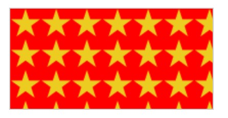
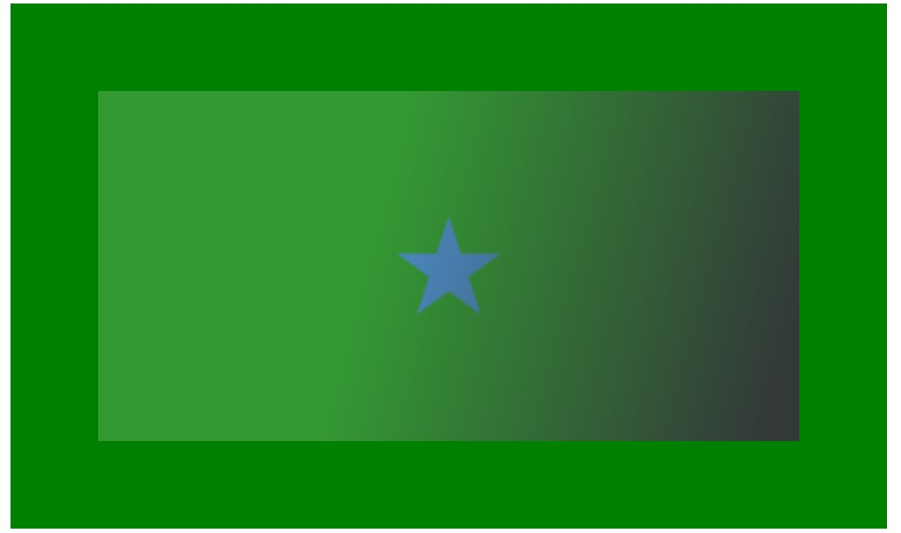

# CSS

## 使用类名

你可以给 HTML 元素加个类名（class），使用这种方式样式化这一片元素

```html
<ul>
  <li>项目一</li>
  <li class="special">项目二</li>
  <li>项目 <em>三</em></li>
</ul>
```

在 CSS 中，要选中这个 `special` 类，只需在选择器的开头加个西文句点（.）。在你的 CSS 文档里加上如下代码：

```css
.special {
  color: orange;
  font-weight: bold;
}
```

这个 `special` 类型可不局限于列表，它可以应用到各种元素上。

## 根据状态确定样式

当我们修改一个链接的样式时我们需要定位（针对） `<a>` （锚）标签。取决于是否是未访问的、访问过的、被鼠标悬停的、被键盘定位的，亦或是正在被点击当中的状态，这个标签有着不同的状态。

下面的 CSS 代码使得没有被访问的链接颜色变为粉色、访问过的链接变为绿色。

```css
a:link {
  color: pink;
}

a:visited {
  color: green;
}
```

## 内联样式

内联样式是影响单个 HTML 元素的 CSS 声明，包含在元素的 `style` 属性中。在一个 HTML 文档中，内联样式的实现可能看起来像这样：

```html
<html lang="zh-CN">
  <head>
    <meta charset="utf-8" />
    <title>我的 CSS 测试</title>
  </head>
  <body>
    <h1 style="color: blue;background-color: yellow;border: 1px solid black;">
      Hello World!
    </h1>
    <p style="color:red;">这是我的第一个 CSS 示例</p>
  </body>
</html>
```

尽可能避免以这种方式使用 CSS。这不符合最佳实践。首先，这是对 CSS 的维护效率最低的实现。一个样式的改变可能需要在一个网页中进行多次编辑。其次，内联 CSS 还将（CSS）表现性代码与 HTML 内容混合在一起，使一切都更难阅读和理解。将代码和内容分开，可以使所有从事网站工作的人更容易维护。

## CSS 究竟是怎么工作的？

当浏览器展示一个文件的时候，它必须兼顾文件的内容和文件的样式信息，下面我们会了解到它处理文件的标准的流程。需要知道的是，下面的步骤是浏览加载网页的简化版本，而且不同的浏览器在处理文件的时候会有不同的方式，但是下面的步骤基本都会出现。

1. 浏览器载入 HTML 文件（比如从网络上获取）。
2. 将 HTML 文件转化成一个 DOM（Document Object Model），DOM 是文件在计算机内存中的表现形式，下一节将更加详细的解释 DOM。
3. 接下来，浏览器会拉取该 HTML 相关的大部分资源，比如嵌入到页面的图片、视频和 CSS 样式。JavaScript 则会稍后进行处理，简单起见，同时此节主讲 CSS，所以这里对如何加载 JavaScript 不会展开叙述。
4. 浏览器拉取到 CSS 之后会进行解析，根据选择器的不同类型（比如 element、class、id 等等）把他们分到不同的“桶”中。浏览器基于它找到的不同的选择器，将不同的规则（基于选择器的规则，如元素选择器、类选择器、id 选择器等）应用在对应的 DOM 的节点中，并添加节点依赖的样式（这个中间步骤称为渲染树）。
5. 上述的规则应用于渲染树之后，渲染树会依照应该出现的结构进行布局。
6. 网页展示在屏幕上（这一步被称为着色）。

结合下面的图示更形象：


## CSS 选择器

> CSS 选择器是 CSS 规则的第一部分。它是元素和其他部分组合起来告诉浏览器哪个 HTML 元素应当是被选为应用规则中的 CSS 属性值的方式。选择器所选择的元素，叫做“选择器的对象”。

### 类型选择器

**类型选择器**有时也叫做“标签名选择器*”*或者是”元素选择器“，因为它在文档中选择了一个 HTML 标签/元素的缘故。

```css
span {
    background-color: yellow;
}

strong {
    color: rebeccapurple;
}

em {
    color: rebeccapurple;
} 
```

### 全局选择器

全局选择器，是由一个星号（`*`）代指的，它选中了文档中的所有内容

```css
* {
    margin: 0;
}
```

### 类选择器

类选择器以一个句点（.）开头，会选择文档中应用了这个类的所有物件。

```css
.highlight {
    background-color: yellow;
}
```

### 指向特定元素的类

我们将会用不同方式高亮一个带有highlight类的`<span>`和带有 highlight类的`<h1>`标题。

```css
span.highlight {
    background-color: yellow;
}

h1.highlight {
    background-color: pink;
}
```

也可以指定存在多个类存在得元素：

```css
.notebox {
  border: 4px solid #666;
  padding: .5em;
}

.notebox.warning {
  border-color: orange;
  font-weight: bold;
}

.notebox.danger {
  border-color: red;
  font-weight: bold;
}
```

### ID 选择器

ID 选择器开头为`#`而非句点，不过基本上和类选择器是同种用法。可是在一篇文档中，一个 ID 只会用到一次。它能选中设定了`id`的元素，你可以在 ID 前面加上类型选择器，只指向元素和 ID 都匹配的类。

```css
#one {
    background-color: yellow;
}

h1#heading {
    color: rebeccapurple;
}
  
```

正如我们在和特定性相关的课里面学到的那样，ID 所指特定，会优先于大多数其他选择器。所以很难处理它们。大多数情况下，给一个元素加个类，而不是使用 ID，会更好。不过要是 ID 是唯一一种指定这个元素的方式的话——也许是因为你没法访问标记标记因此不能编辑——这种方式可行。

### 属性选择器

#### 存否和值选择器

这些选择器允许基于一个元素自身是否存在（例如href）或者基于各式不同的按属性值的匹配，来选取元素。

| 选择器              | 示例                            | 描述                                                         |
| :------------------ | :------------------------------ | :----------------------------------------------------------- |
| `[*attr*]`          | `a[title]`                      | 匹配带有一个名为*attr*的属性的元素——方括号里的值。           |
| `[*attr*=*value*]`  | `a[href="https://example.com"]` | 匹配带有一个名为*attr*的属性的元素，其值正为*value*——引号中的字符串。 |
| `[*attr*~=*value*]` | `p[class~="special"]`           | 匹配带有一个名为*attr*的属性的元素，其值正为*value*，或者匹配带有一个*attr*属性的元素，其值有一个或者更多，至少有一个和*value*匹配。注意，在一列中的好几个值，是用空格隔开的。 |
| `[*attr*|=*value*]` | `div[lang|="zh"]`               | 匹配带有一个名为*attr*的属性的元素，其值可正为*value*，或者开始为*value*，后面紧随着一个连字符。 |

#### 子字符串匹配选择器

这些选择器让更高级的属性的值的子字符串的匹配变得可行。例如，如果你有box-warning和box-error类，想把开头为“box-”字符串的每个物件都匹配上的话，你可以用[class^="box-"]来把它们两个都选中。

| 选择器          | 示例                | 描述                                                         |
| :-------------- | :------------------ | :----------------------------------------------------------- |
| `[attr^=value]` | `li[class^="box-"]` | 匹配带有一个名为*attr*的属性的元素，其值开头为*value*子字符串。 |
| `[attr$=value]` | `li[class$="-box"]` | 匹配带有一个名为*attr*的属性的元素，其值结尾为*value*子字符串 |
| `[attr*=value]` | `li[class*="box"]`  | 匹配带有一个名为*attr*的属性的元素，其值的字符串中的任何地方，至少出现了一次*value*子字符串。 |

### 伪类

伪类是选择器的一种，它用于选择处于特定状态的元素，比如当它们是这一类型的第一个元素时，或者是当鼠标指针悬浮在元素上面的时候。

伪类就是开头为冒号的关键字：

```css
:pseudo-class-name
```

我们可以使用`:first-child`伪类选择器——这将一直选中文章中的第一个子元素

```css
article p:first-child {
    font-size: 120%;
    font-weight: bold;
}   
```


**用户行为伪类**

一些伪类只会在用户以某种方式和文档交互的时候应用。这些**用户行为伪类**，有时叫做**动态伪类**，表现得就像是一个类在用户和元素交互的时候加到了元素上一样。案例包括：

- [`:hover`](https://developer.mozilla.org/zh-CN/docs/Web/CSS/:hover)——上面提到过，只会在用户将指针挪到元素上的时候才会激活，一般就是链接元素。
- [`:focus`](https://developer.mozilla.org/zh-CN/docs/Web/CSS/:focus)——只会在用户使用键盘控制，选定元素的时候激活。

```css
a:link,
a:visited {
    color: rebeccapurple;
    font-weight: bold;
}

a:hover {
    color:hotpink;
}   
```


| 选择器                                                       | 描述                                                         |
| :----------------------------------------------------------- | :----------------------------------------------------------- |
| [`:active`](https://developer.mozilla.org/zh-CN/docs/Web/CSS/:active) | 在用户激活（例如点击）元素的时候匹配。                       |
| [`:any-link`](https://developer.mozilla.org/zh-CN/docs/Web/CSS/:any-link) | 匹配一个链接的`:link`和`:visited`状态。                      |
| [`:blank`](https://developer.mozilla.org/zh-CN/docs/Web/CSS/:blank) | 匹配空输入值的[`<input>`元素](https://developer.mozilla.org/zh-CN/docs/Web/HTML/Element/input)。 |
| [`:checked`](https://developer.mozilla.org/zh-CN/docs/Web/CSS/:checked) | 匹配处于选中状态的单选或者复选框。                           |
| [`:current` (en-US)](https://developer.mozilla.org/en-US/docs/Web/CSS/:current) | 匹配正在展示的元素，或者其上级元素。                         |
| [`:default`](https://developer.mozilla.org/zh-CN/docs/Web/CSS/:default) | 匹配一组相似的元素中默认的一个或者更多的 UI 元素。           |
| [`:dir`](https://developer.mozilla.org/zh-CN/docs/Web/CSS/:dir) | 基于其方向性（HTML[`dir`](https://developer.mozilla.org/zh-CN/docs/Web/HTML/Global_attributes/dir)属性或者 CSS[`direction`](https://developer.mozilla.org/zh-CN/docs/Web/CSS/direction)属性的值）匹配一个元素。 |
| [`:disabled`](https://developer.mozilla.org/zh-CN/docs/Web/CSS/:disabled) | 匹配处于关闭状态的用户界面元素                               |
| [`:empty`](https://developer.mozilla.org/zh-CN/docs/Web/CSS/:empty) | 匹配除了可能存在的空格外，没有子元素的元素。                 |
| [`:enabled`](https://developer.mozilla.org/zh-CN/docs/Web/CSS/:enabled) | 匹配处于开启状态的用户界面元素。                             |
| [`:first`](https://developer.mozilla.org/zh-CN/docs/Web/CSS/:first) | 匹配[分页媒体](https://developer.mozilla.org/zh-CN/docs/Web/CSS/Paged_Media)的第一页。 |
| [`:first-child`](https://developer.mozilla.org/zh-CN/docs/Web/CSS/:first-child) | 匹配兄弟元素中的第一个元素。                                 |
| [`:first-of-type`](https://developer.mozilla.org/zh-CN/docs/Web/CSS/:first-of-type) | 匹配兄弟元素中第一个某种类型的元素。                         |
| [`:focus`](https://developer.mozilla.org/zh-CN/docs/Web/CSS/:focus) | 当一个元素有焦点的时候匹配。                                 |
| [`:focus-visible`](https://developer.mozilla.org/zh-CN/docs/Web/CSS/:focus-visible) | 当元素有焦点，且焦点对用户可见的时候匹配。                   |
| [`:focus-within`](https://developer.mozilla.org/zh-CN/docs/Web/CSS/:focus-within) | 匹配有焦点的元素，以及子代元素有焦点的元素。                 |
| [`:future` (en-US)](https://developer.mozilla.org/en-US/docs/Web/CSS/:future) | 匹配当前元素之后的元素。                                     |
| [`:hover`](https://developer.mozilla.org/zh-CN/docs/Web/CSS/:hover) | 当用户悬浮到一个元素之上的时候匹配。                         |
| [`:indeterminate`](https://developer.mozilla.org/zh-CN/docs/Web/CSS/:indeterminate) | 匹配未定态值的 UI 元素，通常为[复选框](https://developer.mozilla.org/zh-CN/docs/Web/HTML/Element/input/checkbox)。 |
| [`:in-range`](https://developer.mozilla.org/zh-CN/docs/Web/CSS/:in-range) | 用一个区间匹配元素，当值处于区间之内时匹配。                 |
| [`:invalid`](https://developer.mozilla.org/zh-CN/docs/Web/CSS/:invalid) | 匹配诸如`<input>`的位于不可用状态的元素。                    |
| [`:lang`](https://developer.mozilla.org/zh-CN/docs/Web/CSS/:lang) | 基于语言（HTML[lang](https://developer.mozilla.org/zh-CN/docs/Web/HTML/Global_attributes/lang)属性的值）匹配元素。 |
| [`:last-child`](https://developer.mozilla.org/zh-CN/docs/Web/CSS/:last-child) | 匹配兄弟元素中最末的那个元素。                               |
| [`:last-of-type`](https://developer.mozilla.org/zh-CN/docs/Web/CSS/:last-of-type) | 匹配兄弟元素中最后一个某种类型的元素。                       |
| [`:left`](https://developer.mozilla.org/zh-CN/docs/Web/CSS/:left) | 在[分页媒体 (en-US)](https://developer.mozilla.org/en-US/docs/Web/CSS/CSS_paged_media)中，匹配左手边的页。 |
| [`:link`](https://developer.mozilla.org/zh-CN/docs/Web/CSS/:link) | 匹配未曾访问的链接。                                         |
| [`:local-link` (en-US)](https://developer.mozilla.org/en-US/docs/Web/CSS/:local-link) | 匹配指向和当前文档同一网站页面的链接。                       |
| [`:is()`](https://developer.mozilla.org/zh-CN/docs/Web/CSS/:is) | 匹配传入的选择器列表中的任何选择器。                         |
| [`:not`](https://developer.mozilla.org/zh-CN/docs/Web/CSS/:not) | 匹配作为值传入自身的选择器未匹配的物件。                     |
| [`:nth-child`](https://developer.mozilla.org/zh-CN/docs/Web/CSS/:nth-child) | 匹配一列兄弟元素中的元素——兄弟元素按照*an+b*形式的式子进行匹配（比如 2n+1 匹配元素 1、3、5、7 等。即所有的奇数个）。 |
| [`:nth-of-type`](https://developer.mozilla.org/zh-CN/docs/Web/CSS/:nth-of-type) | 匹配某种类型的一列兄弟元素（比如，`<p>`元素）——兄弟元素按照*an+b*形式的式子进行匹配（比如 2n+1 匹配元素 1、3、5、7 等。即所有的奇数个）。 |
| [`:nth-last-child`](https://developer.mozilla.org/zh-CN/docs/Web/CSS/:nth-last-child) | 匹配一列兄弟元素，从后往前倒数。兄弟元素按照*an+b*形式的式子进行匹配（比如 2n+1 匹配按照顺序来的最后一个元素，然后往前两个，再往前两个，诸如此类。从后往前数的所有奇数个）。 |
| [`:nth-last-of-type`](https://developer.mozilla.org/zh-CN/docs/Web/CSS/:nth-last-of-type) | 匹配某种类型的一列兄弟元素（比如，`<p>`元素），从后往前倒数。兄弟元素按照*an+b*形式的式子进行匹配（比如 2n+1 匹配按照顺序来的最后一个元素，然后往前两个，再往前两个，诸如此类。从后往前数的所有奇数个）。 |
| [`:only-child`](https://developer.mozilla.org/zh-CN/docs/Web/CSS/:only-child) | 匹配没有兄弟元素的元素。                                     |
| [`:only-of-type`](https://developer.mozilla.org/zh-CN/docs/Web/CSS/:only-of-type) | 匹配兄弟元素中某类型仅有的元素。                             |
| [`:optional`](https://developer.mozilla.org/zh-CN/docs/Web/CSS/:optional) | 匹配不是必填的 form 元素。                                   |
| [`:out-of-range`](https://developer.mozilla.org/zh-CN/docs/Web/CSS/:out-of-range) | 按区间匹配元素，当值不在区间内的的时候匹配。                 |
| [`:past` (en-US)](https://developer.mozilla.org/en-US/docs/Web/CSS/:past) | 匹配当前元素之前的元素。                                     |
| [`:placeholder-shown`](https://developer.mozilla.org/zh-CN/docs/Web/CSS/:placeholder-shown) | 匹配显示占位文字的 input 元素。                              |
| [`:playing`](https://developer.mozilla.org/zh-CN/docs/Web/CSS/:playing) | 匹配代表音频、视频或者相似的能“播放”或者“暂停”的资源的，且正在“播放”的元素。 |
| [`:paused`](https://developer.mozilla.org/zh-CN/docs/Web/CSS/:paused) | 匹配代表音频、视频或者相似的能“播放”或者“暂停”的资源的，且正在“暂停”的元素。 |
| [`:read-only`](https://developer.mozilla.org/zh-CN/docs/Web/CSS/:read-only) | 匹配用户不可更改的元素。                                     |
| [`:read-write`](https://developer.mozilla.org/zh-CN/docs/Web/CSS/:read-write) | 匹配用户可更改的元素。                                       |
| [`:required`](https://developer.mozilla.org/zh-CN/docs/Web/CSS/:required) | 匹配必填的 form 元素。                                       |
| [`:right`](https://developer.mozilla.org/zh-CN/docs/Web/CSS/:right) | 在[分页媒体 (en-US)](https://developer.mozilla.org/en-US/docs/Web/CSS/CSS_paged_media)中，匹配右手边的页。 |
| [`:root`](https://developer.mozilla.org/zh-CN/docs/Web/CSS/:root) | 匹配文档的根元素。                                           |
| [`:scope`](https://developer.mozilla.org/zh-CN/docs/Web/CSS/:scope) | 匹配任何为参考点元素的的元素。                               |
| [`:valid`](https://developer.mozilla.org/zh-CN/docs/Web/CSS/:valid) | 匹配诸如`<input>`元素的处于可用状态的元素。                  |
| [`:target`](https://developer.mozilla.org/zh-CN/docs/Web/CSS/:target) | 匹配当前 URL 目标的元素（例如如果它有一个匹配当前[URL 分段](https://en.wikipedia.org/wiki/Fragment_identifier)的元素）。 |
| [`:visited`](https://developer.mozilla.org/zh-CN/docs/Web/CSS/:visited) | 匹配已访问链接。                                             |


### 伪元素

伪元素以类似方式表现，不过表现得是像你往标记文本中加入全新的 HTML 元素一样，而不是向现有的元素上应用类。伪元素开头为双冒号`::`。


例如，如果你想选中一段的第一行，你可以把它用一个`<span>`元素包起来，然后使用元素选择器；不过，如果包起来的单词/字符数目长于或者短于父元素的宽度，这样做会失败。由于我们一般不会知道一行能放下多少单词/字符——因为屏幕宽度或者字体大小改变的时候这也会变——通过改变 HTML 的方式来可预测地这么做是不可能的。


`::first-line`伪元素选择器会值得信赖地做到这件事——即使单词/字符的数目改变，它也只会选中第一行。

```css
article p::first-line {
    font-size: 120%;
    font-weight: bold;
}   
```

这表现得就像是`<span>`神奇地包在第一个被格式化的行一样，每当行长改变的时候还会更新。

你可以看到它把两段的第一行都选中了。


**把伪类和伪元素组合起来**

如果你想让第一段的第一行加粗，你需要把:first-child和::first-line选择器放到一起。

```css
article p:first-child::first-line {
  font-size: 120%;
  font-weight: bold;
}
```


**生成带有`::before` 和`::after` 的内容**

有一组特别的伪元素，它们和content属性一同使用，使用 CSS 将内容插入到你的文档中中。


你能用这些插入一个文本字符串，和在下面的实时示例里那样。试着改变[`content`](https://developer.mozilla.org/zh-CN/docs/Web/CSS/content)属性的文本值，看看输出是怎么改变的。你也能改变`::before`伪元素为`::after`，看到这段文本插入到了元素的末尾而不是开头。

```css
.box::before {
    content: "This should show before the other content. ";
}   
    
```

| 选择器                                                       | 描述                                                 |
| :----------------------------------------------------------- | :--------------------------------------------------- |
| [`::after`](https://developer.mozilla.org/zh-CN/docs/Web/CSS/::after) | 匹配出现在原有元素的实际内容之后的一个可样式化元素。 |
| [`::before`](https://developer.mozilla.org/zh-CN/docs/Web/CSS/::before) | 匹配出现在原有元素的实际内容之前的一个可样式化元素。 |
| [`::first-letter`](https://developer.mozilla.org/zh-CN/docs/Web/CSS/::first-letter) | 匹配元素的第一个字母。                               |
| [`::first-line`](https://developer.mozilla.org/zh-CN/docs/Web/CSS/::first-line) | 匹配包含此伪元素的元素的第一行。                     |
| [`::grammar-error`](https://developer.mozilla.org/zh-CN/docs/Web/CSS/::grammar-error) | 匹配文档中包含了浏览器标记的语法错误的那部分。       |
| [`::selection`](https://developer.mozilla.org/zh-CN/docs/Web/CSS/::selection) | 匹配文档中被选择的那部分。                           |
| [`::spelling-error`](https://developer.mozilla.org/zh-CN/docs/Web/CSS/::spelling-error) | 匹配文档中包含了浏览器标记的拼写错误的那部分。       |

### 后代选择器

后代选择器——典型用单个空格（" "）字符——组合两个选择器


下面的示例中，我们只会匹配处于带有.box类的元素里面的`<p>`元素。

```css
.box p {
    color: red;
}  
```

### 子代关系选择器

子代关系选择器是个大于号（`>`），只会在选择器选中直接子元素的时候匹配。

```css
ul > li {
    border-top: 5px solid red;
}  
    
```

### 邻接兄弟选择器

邻接兄弟选择器（`+`）用来选中恰好处于另一个在继承关系上同级的元素旁边的物件。例如，选中所有紧随`<p>`元素之后的``元素：

```CSS
p + img {
	padding: .5em;
}
```

### 通用兄弟选择器

如果你想选中一个元素的兄弟元素，即使它们不直接相邻，你还是可以使用通用兄弟关系选择器（`~`）。要选中所有的`<p>`元素后*任何地方*的``元素，我们会这样做：

```css
 p ~ img {   
 	padding: .5em;
 }
```

## 层叠与继承

### 层叠

> 样式表层叠——简单的说，就是 CSS 规则的顺序很重要；当应用两条同级别的规则到一个元素的时候，写在后面的就是实际使用的规则

下面的示例中，我们有两个关于 `<h1>` 的规则。`<h1>` 最后显示蓝色——这两个规则来自同一个源，且具有相同的元素选择器，有相同的优先级，所以顺序在最后的生效。

```css
h1 { 
    color: red; 
}
h1 { 
    color: blue; 
}
```

### 优先级

> 浏览器是根据优先级来决定当多个规则有不同选择器对应相同的元素的时候需要使用哪个规则。
>
> 你会发现在一些情况下，有些规则在最后出现，但是却应用了前面的具有冲突的规则。这是因为前面的有更高的**优先级**——它范围更小，因此浏览器就把它选择为元素的样式。


现在让我们来看看浏览器如何计算优先级。

一个选择器的优先级可以说是由三个不同的值（或分量）相加，可以认为是百（ID）十（类）个（元素）

- **ID**：选择器中包含 ID 选择器则百位得一分。
- **类**：选择器中包含类选择器、属性选择器或者伪类则十位得一分。
- **元素**：选择器中包含元素、伪元素选择器则个位得一分。

下面有几个单独的例子:

| 选择器                                    | ID   | 类   | 元素 | 优先级 |
| :---------------------------------------- | :--- | :--- | :--- | :----- |
| `h1`                                      | 0    | 0    | 1    | 0-0-1  |
| `h1 + p::first-letter`                    | 0    | 0    | 3    | 0-0-3  |
| `li > a[href*="en-US"] > .inline-warning` | 0    | 2    | 2    | 0-2-2  |
| `#identifier`                             | 1    | 0    | 0    | 1-0-0  |
| `button:not(#mainBtn, .cta)`              | 1    | 0    | 1    | 1-0-1  |


**其他特殊优先级**

1. 内联样式

   内联样式，即 `style` 属性内的样式声明，优先于所有普通的样式，无论其优先级如何。这样的声明没有选择器，但它们的优先级可以理解为 1-0-0-0；即无论选择器中有多少个 ID，它总是比其他任何优先级的权重都要高。

2. !important

   有一个特殊的 CSS 可以用来覆盖所有上面所有优先级计算，不过需要很小心的使用——!important。用于修改特定属性的值，能够覆盖普通规则的层叠。

   ```css
   border: none !important;
   ```

   

### 继承

> 继承也需要在上下文中去理解——一些设置在父元素上的 CSS 属性是可以被子元素继承的，有些则不能。

举一个例子，如果你设置一个元素的 `color` 和 `font-family`，每个在里面的元素也都会有相同的属性，除非你直接在元素上设置属性。

一些属性是不能继承的——举个例子如果你在一个元素上设置 [`width`](https://developer.mozilla.org/zh-CN/docs/Web/CSS/width) 为 50% ，所有的后代不会是父元素的宽度的 50% 。如果这个也可以继承的话，CSS 就会很难使用了！

#### 控制继承

CSS 为控制继承提供了五个特殊的通用属性值。每个 CSS 属性都接收这些值。

[`inherit`](https://developer.mozilla.org/zh-CN/docs/Web/CSS/inherit) 设置该属性会使子元素属性和父元素相同。实际上，就是“开启继承”。

[`initial`](https://developer.mozilla.org/zh-CN/docs/Web/CSS/initial)将应用于选定元素的属性值设置为该属性的初始值。

[`revert`](https://developer.mozilla.org/en-US/docs/Web/CSS/revert)将应用于选定元素的属性值重置为浏览器的默认样式，而不是应用于该属性的默认值。

[`unset`](https://developer.mozilla.org/zh-CN/docs/Web/CSS/unset)如果有可以继承得属性，则将该属性设置为继承的值，如果没有继承属性，则设置为初始值


**重设所有属性值**

CSS 的简写属性 [`all`](https://developer.mozilla.org/zh-CN/docs/Web/CSS/all) 可以用于同时将这些继承值中的一个应用于（几乎）所有属性。它的值可以是其中任意一个（`inherit`、`initial`、`unset` 或 `revert`）。这是一种撤销对样式所做更改的简便方法，以便回到之前已知的起点。

```html
        <blockquote>
            <p>This blockquote is styled</p>
        </blockquote>

        <blockquote class="fix-this">
            <p>This blockquote is not styled</p>
        </blockquote>
```

```css
blockquote {
    background-color: orange;
    border: 2px solid blue;
}
        
.fix-this {
    all: unset;
}
  
```

上述案例会使`.fix-this`的元素只应用可以继承的属性

## 外边距

> 外边距是盒子周围一圈看不到的空间。它会把其他元素从盒子旁边推开。外边距属性值可以为正也可以为负。设置负值会导致和其他内容重叠。无论使用标准模型还是替代模型，外边距总是在计算可见部分后额外添加。

我们可以使用`margin`属性一次控制一个元素的所有边距，或者每边单独使用等价的普通属性控制：

**一次控制：**

​	`	margin :上 右 下 左;`

​	`margin : 上下 左右;`

单独控制：

- margin-top
- margin-right
- margin-bottom
- margin-left

#### 外边距折叠

理解外边距的一个关键是外边距折叠的概念。如果你有两个外边距相接的元素，这些外边距将合并为一个外边距，即最大的单个外边距的大小。

## 内边距

> 内边距位于边框和内容区域之间。与外边距不同，您不能有负数量的内边距，所以值必须是 0 或正的值。应用于元素的任何背景都将显示在内边距后面，内边距通常用于将内容推离边框。

我们可以使用`padding`简写属性控制元素所有边，或者每边单独使用等价的普通属性：

控制方式`和margin一样`

## 边框

> 边框是在边距和填充框之间绘制的。如果您正在使用标准的盒模型，边框的大小将添加到框的宽度和高度。如果您使用的是替代盒模型，那么边框的大小会使内容框更小，因为它会占用一些可用的宽度和高度。


为边框设置样式时，有大量的属性可以使用——有四个边框，每个边框都有样式、宽度和颜色，我们可能需要对它们进行操作。


**简写语法：**

```css
/* style */
border: solid;

/* width | style */
border: 2px dotted;

/* style | color */
border: outset #f33;

/* width | style | color */
border: medium dashed green;
```


**圆角：**

盒子上的圆角是通过使用 [`border-radius`](https://developer.mozilla.org/zh-CN/docs/Web/CSS/border-radius) 属性和与盒子的每个角相关的普通属性来实现的。两个长度或百分比可以作为一个值，第一个值定义水平半径，第二个值定义垂直半径。在很多情况下，你只会传入一个值，这个值会被用于这两个。


例如，要使一个盒子的四个角都有 10px 的圆角半径：

```css
.box {
  border-radius: 10px;
}
```

或使右上角的水平半径为 1em，垂直半径为 10％：

```css
.box {
  border-top-right-radius: 1em 10%;
}
```

我们在下面的示例中设置了所有四个角，然后更改右上角的值使之不同。你可以使用这些值来更改圆角样式。

```css
.box {
  border: 10px solid rebeccapurple;
  border-radius: 1em;
  border-top-right-radius: 10% 30%;
}
```


## 盒模型

> ​	在 CSS 中，所有的元素都被一个个的“盒子（box）”包围着，理解这些“盒子”的基本原理，是我们使用 CSS 实现准确布局、处理元素排列的关键。

### 块级盒子（Block box）和 内联盒子（Inline box）


在 CSS 中我们广泛地使用两种“盒子” —— **块级盒子** (**block box**) 和 **内联盒子** (**inline box**)。这两种盒子会在**页面流**（page flow）和元素之间的关系方面表现出不同的行为：


#### 块级盒子

- 块级元素宽度会扩展至和父元素一样宽
- 每个块级元素会换行
- `width` 和 `height` 属性可以发挥作用
- 内边距（padding）, 外边距（margin）和 边框（border）会将其他元素从当前盒子周围“推开”

#### 内联盒子

- 盒子不会产生换行。
- `width` 和 `height` 属性将不起作用
- 垂直方向的内边距、外边距以及边框会被应用但是`不会`把其他处于 `inline` 状态的盒子推开。
- 水平方向的内边距、外边距以及边框会被应用且`会`把其他处于 `inline` 状态的盒子推开。

用做链接的 `<a>` 元素、 `<span>`、 `<em>` 以及 `<strong>` 都是默认处于 `inline` 状态的。

我们通过对盒子`display` 属性的设置，比如 `inline` 或者 `block` ，来控制盒子的外部显示类型。


### CSS 盒模型

> 使用box-sizing属性来设置盒模型

#### 标准盒模型（Content box）

在标准模型中，如果你给盒设置 `width` 和 `height`，实际设置的是 *`content box`*。`padding` 和 `border` 再加上设置的宽高一起决定整个盒子的大小。见下图。


假设定义了 `width`, `height`, `margin`, `border`, and `padding`:

```css
.box {
  width: 350px;
  height: 150px;
  margin: 25px;
  padding: 25px;
  border: 5px solid black;
}
```

如果使用标准模型，实际占用空间的宽高分别为：宽度 = 410px (350 + 25 + 25 + 5 + 5)，高度 = 210px (150 + 25 + 25 + 5 + 5)。

> **备注：** margin 不计入实际大小 —— 当然，它会影响盒子在页面所占空间，但是影响的是盒子外部空间。盒子的范围到边框为止 —— 不会延伸到 margin。


#### 替代（IE）盒模型（border-box）

你可能会认为盒子的大小还要加上边框和内边距，这样很麻烦，而且你的想法是对的 ! 因为这个原因，css 还有一个替代盒模型。使用这个模型，所有宽度都是可见宽度，所以内容宽度是该宽度减去边框和填充部分。使用上面相同的样式得到 (width = 350px, height = 150px).


`默认浏览器会使用标准模型。`如果需要使用替代模型，您可以通过为其设置 box-sizing: border-box 来实现。这样就可以告诉浏览器使用 border-box 来定义区域，从而设定您想要的大小。

如果你希望所有元素都使用替代模式，而且确实很常用，设置 `box-sizing` 在 `<html>` 元素上，然后设置所有元素继承该属性，正如下面的例子。如果想要深入理解

```css
html {
  box-sizing: border-box;
}
*, *::before, *::after {
  box-sizing: inherit;
}
```


### display: inline-block

> display 有一个特殊的值，它在内联和块之间提供了一个中间状态。这对于以下情况非常有用：您不希望一个项切换到新行，但希望它可以设定宽度和高度，并避免上面看到的重叠。

一个元素使用 `display: inline-block`，实现我们需要的块级的部分效果：

- 设置`width` 和`height` 属性会生效。
- `padding`, `margin`, 以及`border` 会推开其他元素。


## 背景

### 背景颜色

> [`background-color`](https://developer.mozilla.org/zh-CN/docs/Web/CSS/background-color) 属性定义了 CSS 中任何元素的背景颜色。属性接受任何有效的 `color` 值。`background-color` 可以延伸至元素的内容和内边距盒子的下面。


例子：

```css
.box {
  background-color: #567895;
}

h2 {
  background-color: black;
  color: white;
}
span {
  background-color: rgba(255,255,255,.5);
}
    
```

### 背景图像

> [`background-image`](https://developer.mozilla.org/zh-CN/docs/Web/CSS/background-image) 属性可以在一个元素的背景中显示一个图像。

默认情况下，大图不会缩小以适应盒子，因此我们只能看到它的一个小角，而小图则是`平铺`以填充方框。

```css
.a {
  background-image: url(balloons.jpg);
}

.b {
  background-image: url(star.png);
}
    
```


**如果除了背景图像外，还指定了背景颜色，则图像将显示在颜色的顶部。**

```css
.b {
  background-image: url(star.png);
  background-color:red;
}
```




**控制背景平铺行为**

 [`background-repeat`](https://developer.mozilla.org/zh-CN/docs/Web/CSS/background-repeat) 属性用于控制图像的平铺行为。可用的值是：

- `no-repeat`——阻止背景重复平铺。
- `repeat-x`——仅水平方向上重复平铺。
- `repeat-y`——仅垂直方向上重复平铺。
- `repeat`——默认值，在水平和垂直两个方向重复平铺。


**调整背景图像的大小**

例如我们有一个很大的图像，由于它比作为背景的元素大，所以最后被裁剪掉了。在这种情况下，我们可以使用 [`background-size`](https://developer.mozilla.org/zh-CN/docs/Web/CSS/background-size) 属性，它可以设置`长度`或`百分比`值，来调整图像的大小以适应背景。


你也可以使用关键字：

- `cover`：浏览器将使图像足够大，使它完全覆盖了盒子区域，同时仍然保持其宽高比。在这种情况下，图像的部分区域可能会跳出盒子外。
- `contain`：浏览器会将图像调整到适合框内的尺寸。在这种情况下，如果图像的长宽比与盒子的长宽比不同，你可能会在图像的两边或顶部和底部出现空隙。


**背景图像定位**

[`background-position`](https://developer.mozilla.org/zh-CN/docs/Web/CSS/background-position) 属性允许你选择背景图片出现在它所应用的盒子上的位置。这使用了一个坐标系统，其中方框的左上角是 `(0,0)`，方框沿水平（`x`）和垂直（`y`）轴定位。

**备注：** 默认的 `background-position` 值是 `(0,0)`。


你可以使用像 `top` 和 `right` 这样的关键字

```css
.box {
  background-image: url(star.png);
  background-repeat: no-repeat;
  background-position: top center;
}
```

或者使用`长度`和`百分比`值：

```css
.box {
  background-image: url(star.png);
  background-repeat: no-repeat;
  background-position: 20px 10%;
}
```

你也可以将关键字与长度或百分比混合在一起，在这种情况下，第一个值必须指水平位置或偏移，第二个值指垂直位置。例如：

```css
.box {
  background-image: url(star.png);
  background-repeat: no-repeat;
  background-position: 20px top;
}
```

最后，你还可以使用四值语法来指示到盒子的某些边的距离——在本例中，长度单位是与其前面的值的偏移量。所以在下面的 CSS 中，我们将背景定位在距顶部 20px 和右侧 10px 处:

```css
.box {
  background-image: url(star.png);
  background-repeat: no-repeat;
  background-position: top 20px right 10px;
}
```


**多个背景图像**

也可以有多个背景图像——在单个属性值中指定多个 `background-image` 值，用逗号分隔每个值。

当你这样做时，你可能会出现背景图片相互重叠的情况。背景将分层，最后列出的背景图片位于最下层，而之前的每张图片都堆在代码中紧随其后的那张图片之上


其他 `background-*` 属性也可以像 `background-image` 一样使用逗号分隔的方式设置：

```css
background-image: url(image1.png), url(image2.png), url(image3.png),
  url(image4.png);
background-repeat: no-repeat, repeat-x, repeat;
background-position: 10px 20px, top right;
```

不同属性的每个值，将与其他属性中相同位置的值匹配。例如，上面的 `image1` 的 `background-repeat` 值将是 `no-repeat`。但是，当不同的属性具有不同数量的值时，会发生什么情况呢？答案是较小数量的值会循环——在上面的例子中有四个背景图像，但是只有两个背景位置值。前两个位置值将应用于前两个图像，然后它们将再次循环——`image3` 将被赋予第一个位置值，`image4` 将被赋予第二个位置值。


**背景图片滚动位置**

我们为背景提供的另一个选项是指定内容滚动时的滚动方式。这是用 [`background-attachment`](https://developer.mozilla.org/zh-CN/docs/Web/CSS/background-attachment) 属性控制的，它可以取以下值：

- `scroll`：使元素的背景在页面滚动时滚动。如果滚动了元素内容，则背景不会移动。实际上，背景被固定在页面的相同位置，所以它会随着页面的滚动而滚动。
- `fixed`：使元素的背景固定在视口上，这样当页面或元素内容滚动时，它就不会滚动。它将始终保持在屏幕上相同的位置。
- `local`：将背景固定在它所设置的元素上，所以当你滚动该元素时，背景也随之滚动。

### 渐变背景

> 当渐变用于背景时，也可以使用像图像一样的 [`background-image`](https://developer.mozilla.org/zh-CN/docs/Web/CSS/background-image) 属性设置。

在下面的示例中尝试一些不同的渐变。在这两个盒子里，我们分别有一个线性渐变，它延伸到整个盒子上，还有一个径向渐变，它有一个固定的大小，因此会重复。

```css
.a {
  background-image: linear-gradient(105deg, rgba(0,249,255,1) 39%, rgba(51,56,57,1) 96%);
}

.b {
  background-image: radial-gradient(circle, rgba(0,249,255,1) 39%, rgba(51,56,57,1) 96%);
  background-size: 100px 50px;
}
```


### 背景简写

这里有一些规则，需要在简写背景图像属性时遵循，例如：

- `background-color` 只能在最后一个逗号之后指定。
- `background-size` 值只能立即包含在 `background-position` 之后，用“/”字符分隔，例如：`center/80%`。

```css
.box {
  background:   
    linear-gradient(105deg, rgba(255,255,255,.2) 39%, rgba(51,56,57,1) 96%) center center / 400px 200px no-repeat,
url(big-star.png) center no-repeat, 
    green;
}
```



## 文本方向

**什么是书写模式?**

CSS 中的书写模式是指文本的排列方向是横向还是纵向的。[`writing-mode`](https://developer.mozilla.org/zh-CN/docs/Web/CSS/writing-mode) 属性使我们从一种模式切换到另一种模式。为此，你不必使用一种竖向的语言——你还可以更改部分文字的方向以实现创新性的布局。

[`writing-mode`](https://developer.mozilla.org/zh-CN/docs/Web/CSS/writing-mode)的三个值分别是：

- `horizontal-tb`: 从上至下。对应的文本方向是`横向`的。
- `vertical-rl`: 从右向左。对应的文本方向是`纵向`的。
- `vertical-lr`: 从左向右。对应的文本方向是`纵向`的。


**书写模式块级布局和内联布局得不同**

当我们切换书写模式时，我们也在改变块和内联文本的方向。`horizontal-tb`书写模式下块的方向是从上到下的横向的，而 `vertical-rl`书写模式下块的方向是从右到左的纵向的。因此，块维度指的总是块在页面书写模式下的显示方向。而内联维度指的总是文本方向。

## 溢出

> 我们知道，CSS 中万物皆盒，因此我们可以通过给[`width`](https://developer.mozilla.org/zh-CN/docs/Web/CSS/width)和[`height`](https://developer.mozilla.org/zh-CN/docs/Web/CSS/height)（或者 [`inline-size`](https://developer.mozilla.org/zh-CN/docs/Web/CSS/inline-size) 和 [`block-size`](https://developer.mozilla.org/zh-CN/docs/Web/CSS/block-size)）赋值的方式来约束盒子的尺寸。溢出是在你往盒子里面塞太多东西的时候发生的，所以盒子里面的东西也不会老老实实待着。

**CSS 尽力减少“数据损失”**

只要有可能，CSS 就不会隐藏你的内容，隐藏引起的数据损失通常会造成困扰。在 CSS 的术语里面，这会导致一些内容消失


### overflow 属性

> [`overflow`](https://developer.mozilla.org/zh-CN/docs/Web/CSS/overflow)属性是你控制一个元素溢出的方式，它告诉浏览器你想怎样处理溢出。`overflow`的默认值为`visible`，这就是我们的内容溢出的时候，我们在默认情况下看到它们的原因。

如果你想在内容溢出的时候把它裁剪掉，你可以在你的盒子上设置`overflow: hidden`。这就会像它表面上所显示的那样作用——`隐藏掉溢出`。


也许你还会想在有内容溢出的时候加个滚动条？如果你用了`overflow: scroll`，那么你的浏览器总会`显示滚动条`，即使没有足够多引起溢出的内容。你可能会需要这样的样式，它避免了滚动条在内容变化的时候出现和消失。


在以上的例子里面，我们`仅仅需要在y轴或x方向上滚动`，但是我们在两个方向上都有了滚动条。你可以使用[`overflow-y`](https://developer.mozilla.org/zh-CN/docs/Web/CSS/overflow-y)和[`overflow-x`](https://developer.mozilla.org/zh-CN/docs/Web/CSS/overflow-x)属性，设置`overflow-y: scroll`来仅在`y`轴方向滚动。


如果你只是想让滚动条在有比盒子所能装下更多的内容的时候才显示，那么使用`overflow: auto`。此时`由浏览器决定是否显示滚动条`。桌面浏览器一般仅仅会在有足以引起溢出的内容的时候这么做。

## 调整大小

### 把百分数作为内外边距

如果你把 `margin` 和 `padding` 设置为百分数的话，值是以包含块的**内联尺寸**进行计算的，也就是元素的水平宽度。

如果设置外边距和内边距为10%，所有的外边距和内边距都是宽度的10%

### min- 和 max- 尺寸

除了让万物都有一个确定的大小以外，我们可以让 CSS 给定一个元素的最大或最小尺寸。

如果你有一个包含了变化容量的内容的盒子，而且你总是想让它**至少**有个确定的高度，你应该给它设置一个 [`min-height`](https://developer.mozilla.org/zh-CN/docs/Web/CSS/min-height) 属性。


[`max-width`](https://developer.mozilla.org/zh-CN/docs/Web/CSS/max-width) 的常见用法为，在没有足够空间以原有宽度展示图像时，让图像缩小，同时确保它们不会比这一宽度大。

### 视口单位

在 CSS 中，我们有与视口尺寸相关的度量单位，即意为视口宽度的 `vw` 单位，以及意为视口高度的 `vh` 单位。使用这些单位，你可以把一些东西做得随用户的视口改变大小。

`1vh` 等于视口高度的 1%，`1vw` 则为视口宽度的 1%。你可以用这些单位约束盒子的大小，还有文字的大小。


## 替换元素

> 图像和视频被描述为**[替换元素](https://developer.mozilla.org/zh-CN/docs/Web/CSS/Replaced_element)**。这意味着 CSS 不能影响它们的内部布局——而仅影响它们在页面上相对于其他元素的位置。

### 图像元素填充

你可以选择对容器内的图像作其他方式的处理。例如，你可能想把一张图像调整到能够完全盖住一个盒子的大小。


[`object-fit`](https://developer.mozilla.org/zh-CN/docs/Web/CSS/object-fit) 属性可以在这里帮助你。当使用 `object-fit` 时，替换元素可以以多种方式被调整到合乎盒子的大小。

- contain

  长边填充盒子，保持宽高比

- cover

  短边填充盒子，保持宽高比，会裁剪图片

- fill

  拉伸填充

## 文本样式

### 颜色

[`color`](https://developer.mozilla.org/zh-CN/docs/Web/CSS/color) 属性设置选中元素的文本的颜色 

```css
p {
  color: red;
}
```


### 字体设置

要在你的文本上设置一个不同的字体，你可以使用 [`font-family`](https://developer.mozilla.org/zh-CN/docs/Web/CSS/font-family) 属性

```css
p {
  font-family: arial;
}
```


### 网页安全字体

说到字体可用性，只有某几个字体通常可以应用到所有系统，因此可以毫无顾忌地使用。这些都是所谓的 **网页安全字体**。

| 字体名称        | 泛型       | 注意                                                         |
| :-------------- | :--------- | :----------------------------------------------------------- |
| Arial           | sans-serif | 通常认为最佳做法还是添加 Helvetica 作为 Arial 的首选替代品，尽管它们的字体面几乎相同，但 Helvetica 被认为具有更好的形状，即使 Arial 更广泛地可用。 |
| Courier New     | monospace  | 某些操作系统有一个 Courier New 字体的替代（可能较旧的）版本叫 Courier。使用 Courier New 作为 Courier 的首选替代方案，被认为是最佳做法。 |
| Georgia         | serif      |                                                              |
| Times New Roman | serif      | 某些操作系统有一个 Times New Roman 字体的替代（可能较旧的）版本叫 Times。使用 Times 作为 Times New Roman 的首选替代方案，被认为是最佳做法。 |
| Trebuchet MS    | sans-serif | 您应该小心使用这种字体——它在移动操作系统上并不广泛。         |
| Verdana         | sans-serif |                                                              |


### 默认字体

CSS 定义了 5 个常用的字体名称：`serif`, `sans-serif`, `monospace`, `cursive`, 和 `fantasy`. 这些都是非常通用的，当使用这些通用名称时，使用的字体完全取决于每个浏览器，而且它们所运行的每个操作系统也会有所不同。这是一种糟糕的情况，浏览器会尽力提供一个看上去合适的字体。


### 字体栈

由于你无法保证你想在你的网页上使用的字体的可用性 (甚至一个网络字体可能由于某些原因而出错), 你可以提供一个**字体栈** (**font stack**)，这样的话，浏览器就有多种字体可以选择了。只需包含一个 `font-family` 属性，其值由几个用逗号分离的字体名称组成。

```css
p {
  font-family: "Trebuchet MS", Verdana, sans-serif;
}
```

在这种情况下，浏览器从列表的第一个开始，然后查看在当前机器中，这个字体是否可用。如果可用，就把这个字体应用到选中的元素中。如果不可用，它就移到列表中的下一个字体，然后再检查。

### 字体大小

在调整字体大小时，通过 [`font-size`](https://developer.mozilla.org/zh-CN/docs/Web/CSS/font-size) 属性设置，最常用的单位是：

- `px` (像素): 将像素的值赋予给你的文本。这是一个绝对单位，它导致了在任何情况下，页面上的文本所计算出来的像素值都是一样的。
- `em`: 1em 等于我们设计的当前元素的父元素上设置的字体大小 
- `rem`: 这个单位的效果和 `em` 差不多，除了 1`rem` 等于 HTML 中的根元素的字体大小
